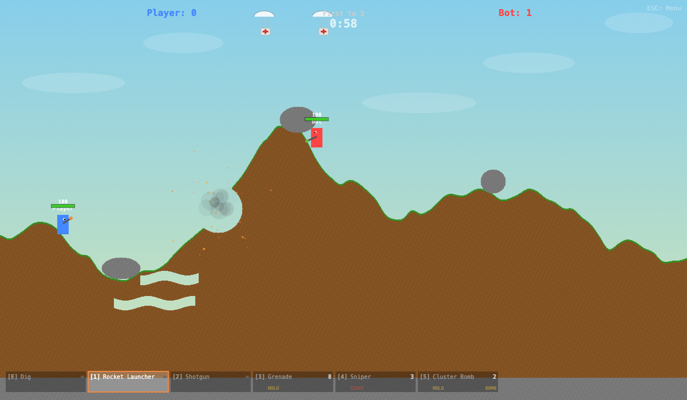

# Boomer

A 1v1 real-time arena shooter (human vs AI): Worms-style destructible
terrain and arcing weapons, but played live rather than turn-based. The
first game in the Boomer trilogy —
[Boomer World](https://github.com/JonMinton/boomerworld) bends this flat
arena into a hollow ring, and
[Boomer Cave](https://github.com/JonMinton/boomercave) fills the ring in
and sends you down inside it.



Built with vanilla JS (ES6 modules) and HTML5 Canvas — no external
dependencies, no build step, no assets: all audio is synthesised live
via the Web Audio API and all visuals are canvas draw calls.

## How to run

ES6 modules need an HTTP server. From the repo root:

```bash
python3 -m http.server 8000
# then open http://localhost:8000
```

Any modern browser.

## The game

- **Destructible terrain** — every pixel has a material (grass, dirt,
  rock, sand, brick, snow, lava) with its own blast resistance, so
  explosions carve weapon-dependent craters. Surfaces have feel: sand
  slows you, snow is slippery, lava burns.
- **Five weapons + a dig tool** — rocket launcher and shotgun are
  unlimited workhorses; grenade launcher and cluster bomb are
  hold-to-charge arc weapons; the sniper is hitscan with a visible
  laser-sight mechanic. The cluster bomb doubles as a proximity mine
  layer. E digs: every obstacle can be tunnelled through.
- **Clamber** — jump at a near-vertical face to grip it, then tap jump
  again to scale it. Every tall obstacle has two routes: through (dig)
  or over (clamber).
- **Self-damage** — explosions hurt everyone, including the firer. Big
  weapons punish careless close-range use; there is no owner immunity.
- **Finite ammo + crate drops** — grenade, sniper and cluster ammo is
  scarce; crates parachute in over the round (35% are med-kits healing
  +35 HP). Shoot the chute and the crate freefalls — and may smash.
- **Headshots** — direct hits to the head deal 1.4× damage. Blast
  splash never qualifies, so explosive spam gains nothing.
- **AI opponent** — a state-machine bot (assess → move → aim → charge →
  fire → dodge) with Easy / Medium / Hard presets, plus a Training mode
  with a passive regenerating dummy.
- **Screen wrap (menu toggle)** — optional toroidal horizontal
  wrapping: walk (or fire) off one edge and reappear on the other.
- **4 maps** — Grasslands, Desert, Urban, Volcanic, procedurally
  varied each round via value-noise heightmaps.
- **What's New** — the main menu carries an abbreviated changelog; the
  full design log with playtest notes is `FEATURES.md`.

## Controls

| Input | Action |
|---|---|
| A / D or ←/→ | Move |
| W / ↑ / Space | Jump; tap while gripping a wall to clamber |
| Mouse | Aim |
| Click / hold | Fire / charge (grenade, cluster) / sight (sniper) |
| E | Dig |
| 1–5 | Weapons (Rocket, Shotgun, Grenade, Sniper, Cluster; press 5 again to toggle mine mode) |
| Q | Next weapon |
| R | Restart round |
| Esc | Menu |

## Architecture

A single 2D canvas. Terrain is a `Uint8Array` material grid — the
texture *is* the game state — and `destroyCircle()` removes pixels by
weapon power vs material resistance. All game code lives in `js/` as
ES6 modules (~15 files); every tuning constant is centralised in
`js/constants.js`. See `CLAUDE.md` for the file-by-file map.

`BOOMER_WORLD.md` is the design document that became
[Boomer World](https://github.com/JonMinton/boomerworld), the
polar-coordinate sequel.

## Conventions

- British spellings in comments and user-facing text
- Conventional commits (`feat:`, `fix:`, …)
- All tuning constants live in `js/constants.js`
- No build step — just serve the directory
